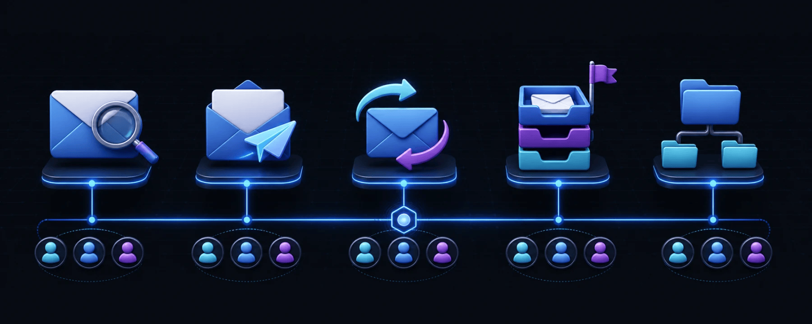

<p align="center">
  
</p>

# Email SMTP/IMAP MCP

One local MCP server for every inbox: search, read, send, reply, forward, and organize email across multiple accounts.

[](https://github.com/samihalawa/email-smtp-imap-mcp/releases/latest)
[](https://github.com/samihalawa/email-smtp-imap-mcp/actions/workflows/ci.yml)
[](https://nodejs.org/)
[](https://github.com/samihalawa/email-smtp-imap-mcp/stargazers)
[](LICENSE)

## Why this server

- **Multi-account by design** — switch between work, personal, support, or client inboxes with `account_name`.
- **SMTP + IMAP together** — send and receive through one small MCP server.
- **Complete everyday workflow** — search, read, reply, forward, attach files, flag, archive, move, and list folders.
- **Provider-agnostic** — works with Gmail, iCloud Mail, Fastmail, Outlook, self-hosted mail, and other standard SMTP/IMAP providers.
- **Local stdio transport** — no hosted relay and no separate control panel.

<p align="center">
  
</p>

## Quick start

Add this to your MCP client configuration. For Claude Desktop, the file is:

- macOS: `~/Library/Application Support/Claude/claude_desktop_config.json`
- Windows: `%APPDATA%\Claude\claude_desktop_config.json`

```json
{
  "mcpServers": {
    "email": {
      "command": "npx",
      "args": ["-y", "github:samihalawa/email-smtp-imap-mcp#v2.1.1"],
      "env": {
        "EMAIL_ACCOUNTS_JSON": "{\"work\":{\"smtp\":{\"host\":\"smtp.gmail.com\",\"port\":587,\"user\":\"work@example.com\",\"password\":\"app-password\"},\"imap\":{\"host\":\"imap.gmail.com\",\"port\":993,\"user\":\"work@example.com\",\"password\":\"app-password\"},\"default_from_name\":\"Your Name\",\"sender_emails\":[\"work@example.com\"]},\"personal\":{\"smtp\":{\"host\":\"smtp.mail.me.com\",\"port\":587,\"user\":\"you@icloud.com\",\"password\":\"app-password\"},\"imap\":{\"host\":\"imap.mail.me.com\",\"port\":993,\"user\":\"you@icloud.com\",\"password\":\"app-password\"},\"default_from_name\":\"Your Name\"}}",
        "DEFAULT_EMAIL_ACCOUNT": "work"
      }
    }
  }
}
```

Replace the addresses and app passwords, restart your MCP client, and ask it to list your email folders.

<details>
<summary>Readable multi-account configuration</summary>

The escaped `EMAIL_ACCOUNTS_JSON` value above represents:

```json
{
  "work": {
    "smtp": {
      "host": "smtp.gmail.com",
      "port": 587,
      "user": "work@example.com",
      "password": "app-password"
    },
    "imap": {
      "host": "imap.gmail.com",
      "port": 993,
      "user": "work@example.com",
      "password": "app-password"
    },
    "default_from_name": "Your Name",
    "sender_emails": ["work@example.com", "alias@example.com"]
  },
  "personal": {
    "smtp": {
      "host": "smtp.mail.me.com",
      "port": 587,
      "user": "you@icloud.com",
      "password": "app-password"
    },
    "imap": {
      "host": "imap.mail.me.com",
      "port": 993,
      "user": "you@icloud.com",
      "password": "app-password"
    },
    "default_from_name": "Your Name"
  }
}
```

</details>

<details>
<summary>Single-account environment variables</summary>

Use `SMTP_HOST`, `SMTP_PORT`, `SMTP_SECURE`, `SMTP_USER`, `SMTP_PASS`, `IMAP_HOST`, `IMAP_PORT`, `IMAP_SECURE`, `IMAP_USER`, and `IMAP_PASS` instead of `EMAIL_ACCOUNTS_JSON`.

`SMTP_USERNAME`/`SMTP_PASSWORD` and `IMAP_USERNAME`/`IMAP_PASSWORD` are accepted aliases. IMAP credentials default to the SMTP credentials when omitted. Use `SENDER_EMAILS` as a comma-separated allowlist for optional `from_email` selection.

</details>

## Tools

| Tool | What it does |
| --- | --- |
| `emails_find` | Search by text, sender, recipient, subject, date, read state, flag state, or attachments. Optionally return bodies and attachments. |
| `email_send` | Send plain-text or HTML email with CC, BCC, sender aliases, and base64 attachments. |
| `email_respond` | Reply, reply-all, or forward by email UID with threading and optional original attachments. |
| `emails_modify` | Mark read/unread, flag/unflag, or move messages to another folder. |
| `folders_list` | List folders with optional total and unread counts. |

Every tool accepts an optional `account_name`. Without it, the server uses `DEFAULT_EMAIL_ACCOUNT` or the first configured account.

## Provider settings

| Provider | SMTP | IMAP | Credential |
| --- | --- | --- | --- |
| Gmail | `smtp.gmail.com:587` | `imap.gmail.com:993` | [App password](https://support.google.com/accounts/answer/185833) |
| iCloud Mail | `smtp.mail.me.com:587` | `imap.mail.me.com:993` | [App-specific password](https://support.apple.com/en-us/102654) |
| Other providers | Use the provider's SMTP host | Use the provider's IMAP host | Provider password or app password |

Use `secure: true` for implicit TLS ports such as 465/993. Port 587 normally uses `secure: false` and upgrades with STARTTLS.

## Development

```bash
git clone https://github.com/samihalawa/email-smtp-imap-mcp.git
cd email-smtp-imap-mcp
npm ci
npm test
```

Run the compiled stdio server with `npm start`. Build a production container with `docker build -t email-smtp-imap-mcp .`.

## Contributing

Issues and focused pull requests are welcome. See [CONTRIBUTING.md](CONTRIBUTING.md) for the development workflow and [SECURITY.md](SECURITY.md) for vulnerability reports.

## License

[MIT](LICENSE) © Sami Halawa
